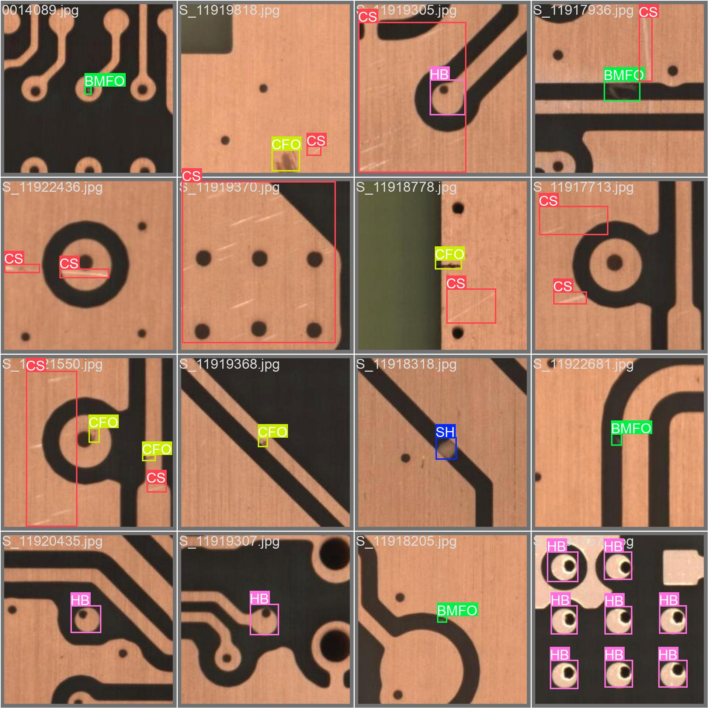
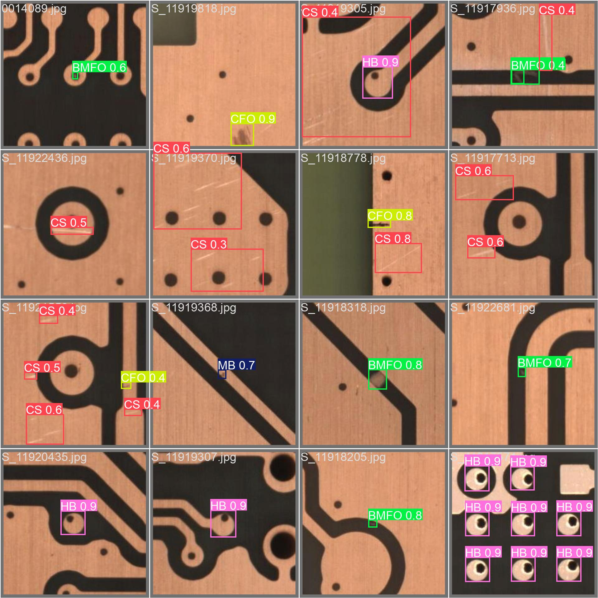
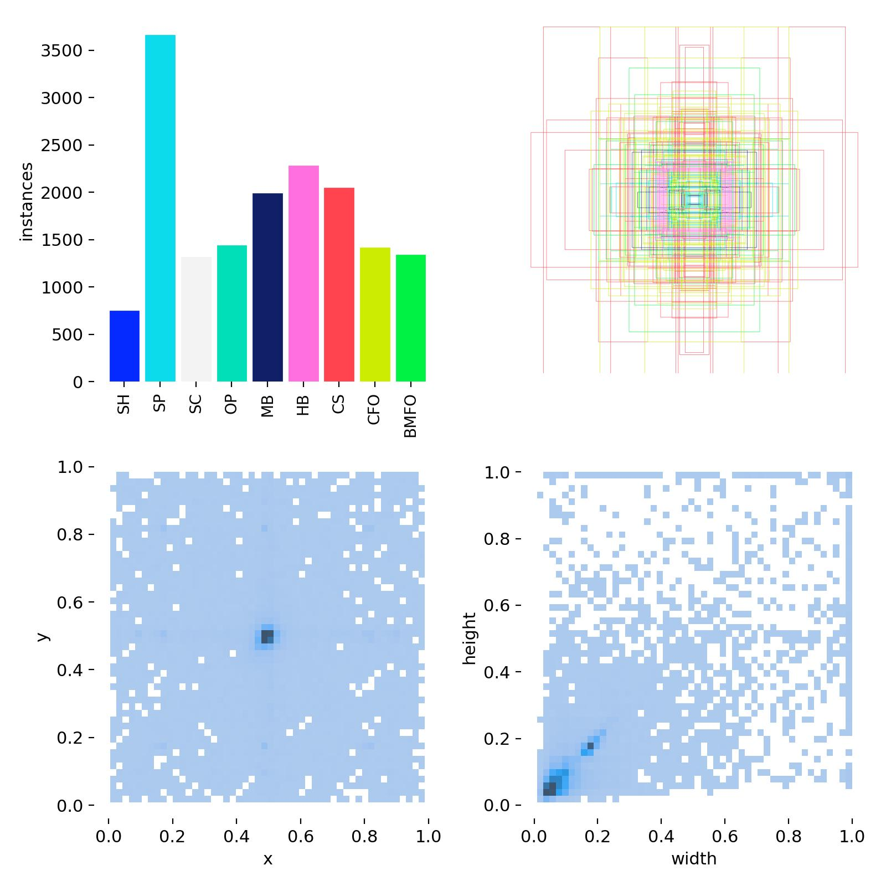
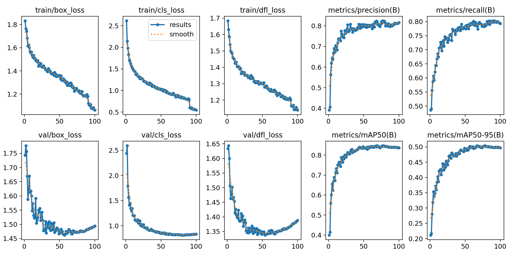

# PCB Defect Detection

Trained an object detection model to find defects on printed circuit boards. It covers 9 defect types and hits **84.7% mAP50** on the validation set after 100 epochs, solid enough for real production-line use.

| Ground truth | Model predictions |
|:---:|:---:|
|  |  |

*Left: the annotated ground truth. Right: what the model actually predicts on unseen images. Each box shows defect type and confidence score. For example, every hole break (HB) detected in the bottom-right panel carries a 0.9 confidence score, meaning the model is 90% sure of both the defect type and its exact location on the board.*

---

## Background

PCB defects usually happen during manufacturing. Etching gone slightly wrong, dust contamination, a drill bit going slightly off-center. Catching them early saves a lot of money. The traditional approach is manual visual inspection, which is slow and error-prone, especially for small defects under magnification.

This project uses **YOLOv8m** to flag defects automatically. YOLO (You Only Look Once) is a family of real-time object detection models built on convolutional neural networks that process the entire image in a single pass, making it much faster than older two-stage detectors without sacrificing much accuracy. The "m" variant is the medium-sized model, a good balance between speed and detection quality. It outputs bounding boxes with confidence scores so you can tune the trade-off between false positives and false negatives depending on how critical your application is.


*YOLOv8 architecture. The backbone extracts features at multiple scales, the neck fuses them, and the detection head predicts boxes and class labels in a single forward pass.*

---

## Dataset

Uses the publicly available **DsPCBSD+** dataset, a collection of PCB images annotated with 9 defect categories. The dataset comes with both YOLO-format and COCO-format annotations, so it's usable with most detection frameworks without any conversion.


*Distribution of defect instances across the training set. Spur (SP) is the most common; Short Circuit (SH) the rarest.*

The 9 defect classes:

| Code | Full name |
|------|-----------|
| SH | Short Circuit |
| SP | Spur |
| SC | Spurious Copper |
| OP | Open Circuit |
| MB | Mousebite |
| HB | Hole Break |
| CS | Conductor Scratch |
| CFO | Copper Foreign Object |
| BMFO | Base Material Foreign Object |

---

## Results

| Metric | Value |
|--------|-------|
| mAP@0.5 | **84.7%** |
| mAP@0.5:0.95 | 49.9% |
| Precision | 81.6% |
| Recall | 79.4% |

mAP@0.5 is the main number to look at: it measures detection accuracy at a 50% overlap threshold between predicted and ground truth boxes. 84.7% is strong for a 9-class industrial defect detector. Precision (81.6%) tells you how often a detection is actually a real defect, while recall (79.4%) tells you how many real defects the model actually catches. The mAP@0.5:0.95 score (49.9%) is stricter, averaging across tighter overlap thresholds, and is harder to push high when defects are small.

Per-class breakdown:

| Defect | Precision | Recall | mAP50 |
|--------|-----------|--------|-------|
| HB (Hole Break) | 94.0% | 94.9% | 98.5% |
| OP (Open Circuit) | 82.6% | 84.0% | 89.9% |
| SH (Short Circuit) | 84.0% | 85.8% | 89.5% |
| BMFO (Base Material Foreign Object) | 82.0% | 84.1% | 87.2% |
| SP (Spur) | 86.7% | 76.2% | 85.2% |
| MB (Mousebite) | 86.2% | 77.5% | 84.5% |
| SC (Spurious Copper) | 75.8% | 76.8% | 83.2% |
| CS (Conductor Scratch) | 75.2% | 67.0% | 74.3% |
| CFO (Copper Foreign Object) | 70.6% | 65.0% | 70.4% |

Hole breaks are nearly perfect because they have a very consistent visual signature: a clean circular gap. The two weakest classes, Conductor Scratch and Copper Foreign Object, are harder because they look different from image to image depending on lighting and board finish. Worth noting that Short Circuit performs near the top of the table despite having the fewest training samples, which suggests the defect is visually distinct enough that the model picks it up easily.


*Loss and metric curves across 100 epochs. Validation mAP stabilizes around epoch 60.*

---

## Setup

```bash
git clone https://github.com/jbobym/pcb-defect-detection.git
cd pcb-defect-detection

python3 -m venv pcb_env
source pcb_env/bin/activate
pip install ultralytics torch torchvision pyyaml
```

You'll also need the DsPCBSD+ dataset. Download it and place it under `data/DsPCBSD+/`. Expected structure:

```
data/DsPCBSD+/
├── Data_YOLO/
│   ├── images/train/ and val/
│   └── labels/train/ and val/
└── Data_COCO/
    └── annotations/
```

---

## Training

```bash
python train.py
```

Uses both GPUs if available (`device='0,1'`). Checkpoints save every 5 epochs to `runs/pcb_defect_detection/weights/`. The best checkpoint by validation mAP is saved as `best.pt`.

Key hyperparameters:
- Model: YOLOv8m pretrained on COCO
- Optimizer: AdamW, lr=0.001 with cosine decay
- Image size: 640px, batch 16 per GPU
- Augmentation: mosaic, mixup=0.1, copy-paste=0.1, horizontal flip

No vertical flips or perspective augmentation. PCB inspection cameras are always overhead, so that kind of distortion would only hurt.

---

## Inference

```python
from ultralytics import YOLO

model = YOLO("runs/pcb_defect_detection/weights/best.pt")
results = model("path/to/pcb_image.jpg", conf=0.25)
results[0].show()
```

An ONNX export is also available at `runs/pcb_defect_detection/weights/best.onnx` for deployment outside Python.
