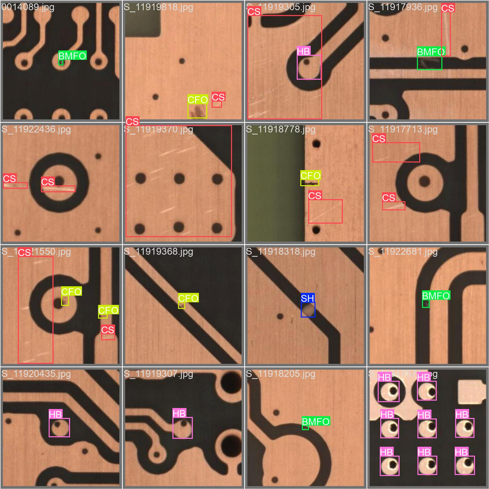
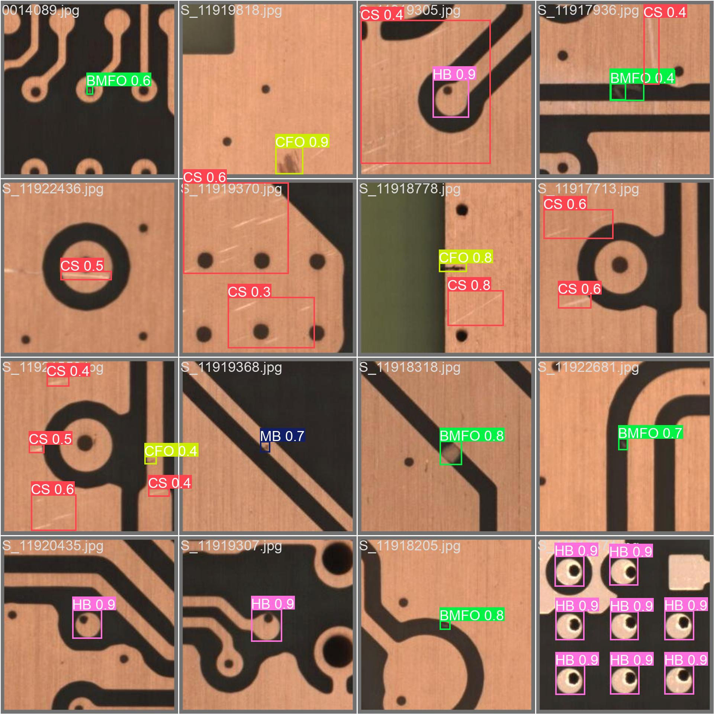
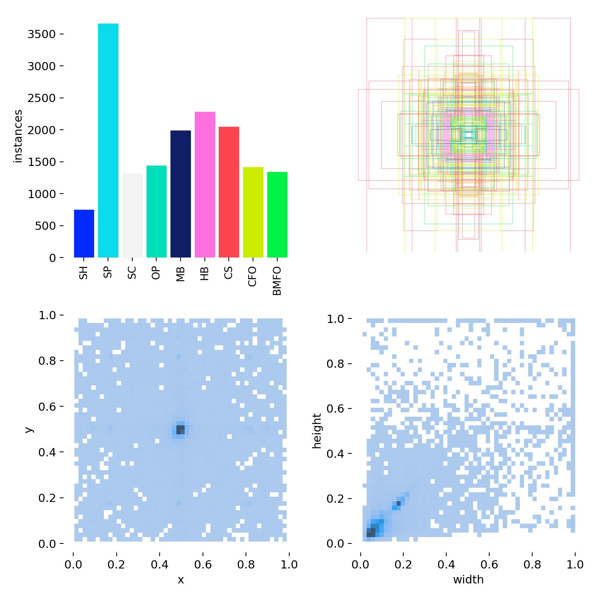
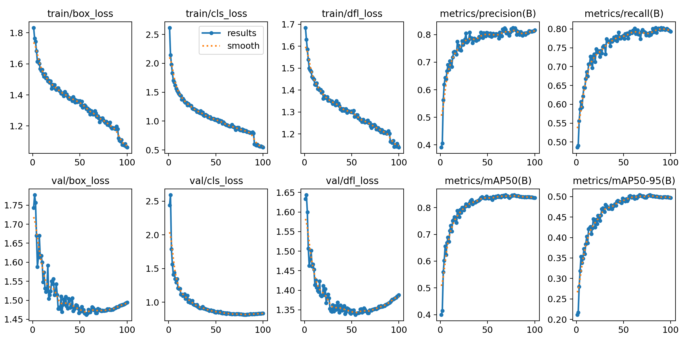

# PCB Defect Detection

I trained YOLOv8m to detect nine types of defects on printed circuit boards using the DsPCBSD+ dataset. After 100 epochs, the model achieved **84.7% mAP@0.5** on the validation set.

| Ground truth | Model predictions |
|:---:|:---:|
|  |  |

*Ground-truth annotations and predictions on validation images. Predicted boxes show the defect class and model confidence score. These scores are not calibrated probabilities of correct classification or exact localization.*

## Background

PCB inspection involves finding defects such as broken connections, unwanted copper, scratches, and foreign material. Small defects can be difficult to identify consistently during visual inspection.

This project explores object detection as a way to automate that task. I used YOLOv8m, the medium-sized YOLOv8 model, starting from weights pretrained on COCO. The model predicts a bounding box and class for each detected defect.


*The backbone extracts image features, the neck combines features across scales, and the detection head predicts bounding boxes and classes.*

## Dataset

The project uses **DsPCBSD+**, a publicly available PCB defect dataset with nine annotated categories. It includes annotations in both YOLO and COCO formats.



*Training-set label distribution. Spur is the most common defect class, and Short Circuit is the least common.*

| Code | Defect |
|---|---|
| SH | Short Circuit |
| SP | Spur |
| SC | Spurious Copper |
| OP | Open Circuit |
| MB | Mousebite |
| HB | Hole Break |
| CS | Conductor Scratch |
| CFO | Copper Foreign Object |
| BMFO | Base Material Foreign Object |

## Results

Validation results after 100 epochs:

| Metric | Value |
|---|---:|
| mAP@0.5 | **84.7%** |
| mAP@0.5:0.95 | 49.9% |
| Precision | 81.6% |
| Recall | 79.4% |

mAP@0.5 evaluates detections at an intersection-over-union (IoU) threshold of 0.5. The stricter mAP@0.5:0.95 metric averages performance across thresholds from 0.5 to 0.95.

The difference between these scores shows that performance drops when tighter agreement between predicted and reference boxes is required. Precision and recall also indicate that the model still produces false detections and misses some defects.

### Results by defect class

| Defect | Precision | Recall | mAP@0.5 |
|---|---:|---:|---:|
| HB — Hole Break | 94.0% | 94.9% | 98.5% |
| OP — Open Circuit | 82.6% | 84.0% | 89.9% |
| SH — Short Circuit | 84.0% | 85.8% | 89.5% |
| BMFO — Base Material Foreign Object | 82.0% | 84.1% | 87.2% |
| SP — Spur | 86.7% | 76.2% | 85.2% |
| MB — Mousebite | 86.2% | 77.5% | 84.5% |
| SC — Spurious Copper | 75.8% | 76.8% | 83.2% |
| CS — Conductor Scratch | 75.2% | 67.0% | 74.3% |
| CFO — Copper Foreign Object | 70.6% | 65.0% | 70.4% |

Hole Break had the highest mAP and recall. Conductor Scratch and Copper Foreign Object were the weakest classes, particularly in recall, making them priorities for further error analysis.

Short Circuit performed well despite having the fewest training examples. Class frequency alone did not explain the differences in performance.



*Training losses and validation metrics over 100 epochs. Validation mAP begins to level off around epoch 60.*

These results describe performance on the dataset’s validation split. Production use would require evaluation on images from the intended inspection setup, including its lighting, cameras, and board types.

## Setup

```bash
git clone https://github.com/jbobym/pcb-defect-detection.git
cd pcb-defect-detection

python3 -m venv pcb_env
source pcb_env/bin/activate
pip install ultralytics torch torchvision pyyaml
```

Download DsPCBSD+ and place it under `data/DsPCBSD+/` with the following structure:

```text
data/DsPCBSD+/
├── Data_YOLO/
│   ├── images/
│   │   ├── train/
│   │   └── val/
│   └── labels/
│       ├── train/
│       └── val/
└── Data_COCO/
    └── annotations/
```

## Training

```bash
python train.py
```

The training script is configured to use GPUs 0 and 1 (`device='0,1'`). Adjust the device setting if your machine has a different GPU configuration.

Checkpoints are saved every five epochs under `runs/pcb_defect_detection/weights/`. The best validation checkpoint is saved as `best.pt`.

### Training configuration

| Setting | Value |
|---|---|
| Model | YOLOv8m, pretrained on COCO |
| Epochs | 100 |
| Optimizer | AdamW |
| Initial learning rate | 0.001 |
| Learning-rate schedule | Cosine decay |
| Image size | 640 pixels |
| Mixup | 0.1 |
| Copy-paste setting | 0.1 |
| Other augmentations | Mosaic and horizontal flips |

Vertical flips and perspective augmentation were disabled for this training run.

### Loss function

Training combines bounding-box, classification, and Distribution Focal Loss (DFL) terms:

$$
\mathcal{L}
= \lambda_{box}\mathcal{L}_{CIoU}
+ \lambda_{cls}\mathcal{L}_{BCE}
+ \lambda_{dfl}\mathcal{L}_{DFL}
$$

The configured weights are:

- Bounding-box loss: 7.5
- Classification loss: 0.5
- DFL: 1.5

CIoU accounts for box overlap, center distance, and aspect ratio. Binary cross-entropy is used for classification, while DFL supports bounding-box localization through discrete distributions.

## Inference

```python
from ultralytics import YOLO

model = YOLO("runs/pcb_defect_detection/weights/best.pt")
results = model("path/to/pcb_image.jpg", conf=0.25)
results[0].show()
```

The `conf` argument sets the detection confidence threshold. Increasing it filters out more low-confidence detections; decreasing it retains more detections, potentially including additional false positives.

An ONNX export is available at:

```text
runs/pcb_defect_detection/weights/best.onnx
```
